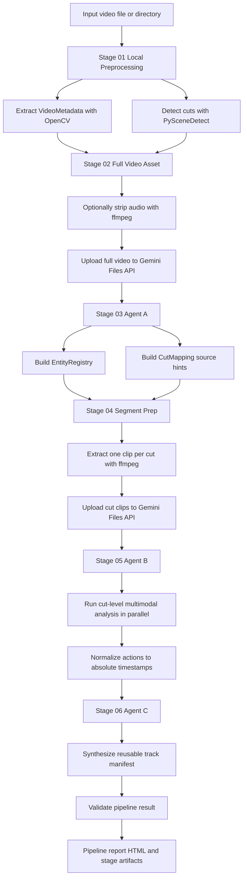

# v2t Prototype

`v2t Prototype`은 입력 비디오의 시각 정보를 분석해 멀티트랙 오디오 생성에 필요한 구조화된 메타데이터를 만드는 실험용 파이프라인입니다. 로컬 전처리로 컷 경계를 고정하고, Gemini 멀티모달 모델을 단계별 에이전트로 사용해 사운드 소스, 컷 단위 이벤트, 최종 트랙 매니페스트를 생성합니다.

## 전체 흐름



## 단계별 역할

- `Stage 01 Local Preprocessing`: OpenCV로 영상 메타데이터를 읽고 PySceneDetect `AdaptiveDetector`로 컷 경계를 검출합니다. 결과는 `Cut[]`와 `VideoMetadata`입니다.
- `Stage 02 Full Video Asset`: 전체 영상을 Gemini Files API에 업로드합니다. 기본값은 오디오를 제거한 임시 영상을 업로드하고, `--preserve-audio`를 주면 원본 오디오를 유지합니다.
- `Stage 03 Agent A`: 전체 영상과 컷 목록을 Gemini에 전달해 `EntityRegistry`와 `CutMapping`을 생성합니다. Agent B가 컷별로 봐야 할 사운드 소스 힌트를 여기서 만듭니다.
- `Stage 04 Segment Prep`: Stage 01 컷 경계를 기준으로 ffmpeg가 컷별 mp4 클립을 만들고 Gemini Files API에 업로드합니다.
- `Stage 05 Agent B`: 컷별 클립을 병렬로 분석해 사운드 액션과 이벤트를 생성합니다. 컷 내부 시간은 영상 전체 기준 절대 시간으로 정규화됩니다.
- `Stage 06 Agent C`: 모든 컷의 액션을 재사용 가능한 트랙 단위로 합성하고 검증합니다.
- 최종 리포트: 각 stage 산출물을 모아 `pipeline_report.html`을 생성합니다.

## 요구사항

- Python `>=3.11`
- `uv`
- Gemini Developer API key
- ffmpeg
  - 시스템에 `ffmpeg`가 있으면 우선 사용합니다.
  - 없으면 `imageio-ffmpeg`가 제공하는 uv-managed ffmpeg 실행 파일로 fallback합니다.

Python 의존성은 `pyproject.toml`에 정의되어 있습니다.

- `google-genai`
- `imageio-ffmpeg`
- `pydantic`
- `pytest`
- `scenedetect[opencv]`

## 설치

저장소 루트에서 다음을 실행합니다.

```bash
cd prototype
uv sync
```

## 환경 설정

실제 Gemini API를 호출하는 Stage 02 이후 단계는 API key가 필요합니다. 저장소 루트의 `.env.example`을 참고해 `.env`를 만듭니다.

```bash
cd ..
cp .env.example .env
```

`.env`에 값을 채웁니다.

```bash
GEMINI_API_KEY=your_api_key_here
```

실행 전에 환경변수를 명시적으로 로드합니다. 터미널 자동 주입에 의존하지 않는 것을 권장합니다.

```bash
cd prototype
if [ -f ../.env ]; then set -a; source ../.env; set +a; fi
```

`.env`와 `.env.*` 파일은 `.gitignore`로 보호됩니다. `.env.example`만 GitHub에 공유됩니다.

## 실행 방법

### 도움말 확인

```bash
cd prototype
uv run python -m v2t_prototype.pipeline_automation --help
```

### 전체 테스트

```bash
cd prototype
uv run python -m pytest
```

이 프로젝트에서는 `uv run pytest`보다 `uv run python -m pytest`를 권장합니다. 환경에 따라 `pytest` 실행 파일이 직접 노출되지 않을 수 있습니다.

### 로컬 전처리만 실행

Gemini API 호출 없이 메타데이터와 컷 검출만 확인할 수 있습니다.

```bash
cd prototype
uv run python - <<'PY'
from pathlib import Path
from v2t_prototype.preprocessing import run_local_preprocessing

video_path = Path("../videos/02_playing_table_tennis__same_class_abab_5s.mp4")
result = run_local_preprocessing(video_path)

print(result.video_metadata)
for cut in result.cuts:
    print(cut)
PY
```

### 단일 영상 전체 파이프라인 실행

```bash
cd prototype
if [ -f ../.env ]; then set -a; source ../.env; set +a; fi

uv run python -m v2t_prototype.pipeline_automation \
  ../videos/02_playing_table_tennis__same_class_abab_5s.mp4 \
  --runs-dir runs
```

완료되면 터미널에 `COMPLETED`와 `run_id`, `run_dir`가 출력됩니다. 실패하면 `FAILED`, 실패 stage, 에러 메시지가 출력됩니다.

### 디렉터리 batch 실행

```bash
cd prototype
if [ -f ../.env ]; then set -a; source ../.env; set +a; fi

uv run python -m v2t_prototype.pipeline_automation \
  ../videos \
  --runs-dir runs \
  --recursive \
  --max-video-concurrency 1 \
  --max-agent-b-concurrency 5
```

지원하는 입력 확장자는 `.avi`, `.m4v`, `.mkv`, `.mov`, `.mp4`, `.mpeg`, `.mpg`, `.webm`입니다.

## 주요 실행 옵션

- `--runs-dir`: 실행 산출물을 저장할 루트 디렉터리입니다. 기본값은 `runs`입니다.
- `--recursive`: 입력이 디렉터리일 때 하위 디렉터리까지 영상 파일을 찾습니다.
- `--ffmpeg-bin`: 사용할 ffmpeg 실행 파일명 또는 경로입니다. 기본값은 `ffmpeg`입니다.
- `--preserve-audio`: 기본 동작은 전체 영상과 컷 클립에서 오디오를 제거한 뒤 업로드합니다. 이 옵션을 주면 원본 오디오를 유지합니다.
- `--model`: Agent A, Agent B, TrackJudge에 공통으로 사용할 Gemini 모델입니다. stage별 모델 옵션이 있으면 stage별 값이 우선합니다.
- `--agent-a-model`: Stage 03 Agent A 모델입니다. 기본값은 `gemini-2.5-pro`입니다.
- `--agent-b-model`: Stage 05 Agent B 모델입니다. 기본값은 `gemini-2.5-pro`입니다.
- `--track-judge-model`: Stage 06 TrackJudge 모델입니다. 기본값은 `gemini-2.5-flash`입니다.
- `--temperature`: 모든 LLM stage의 기본 temperature입니다. 기본값은 `0.0`입니다.
- `--agent-a-temperature`, `--agent-b-temperature`, `--track-judge-temperature`: 특정 stage의 temperature만 덮어씁니다.
- `--top-p`, `--top-k`, `--seed`, `--max-output-tokens`: Gemini generation parameter입니다. 기본 seed는 `42`입니다.
- `--video-fps`: Gemini video metadata에 전달할 fps입니다. 기본값은 `5.0`입니다.
- `--max-video-concurrency`: batch 실행에서 동시에 처리할 영상 수입니다. 기본값은 `1`입니다.
- `--max-agent-b-concurrency`: Stage 05에서 컷별 Agent B 호출을 동시에 실행할 최대 개수입니다. 기본값은 `5`입니다.
- `--max-agent-b-retries`: Agent B의 retry 가능한 오류에 대한 최대 재시도 횟수입니다. 기본값은 `2`입니다.
- `--stop-on-error`: batch 실행 중 실패가 발생하면 즉시 중단합니다.

## 출력 구조

기본 실행 결과는 `prototype/runs/<run_id>/` 아래에 생성됩니다.

```text
runs/<run_id>/
  run_manifest.json
  pipeline_report.html
  stage_01_local_preprocessing/
    output.json
    warnings.json
    report.html
  stage_02_full_video_asset/
    output.json
    warnings.json
    report.html
  stage_03_agent_a/
    input.json
    output.json
    raw_response.txt
    warnings.json
    report.html
  stage_04_segment_prep/
    output.json
    warnings.json
    report.html
    clips/
  stage_05_agent_b/
    output.json
    warnings.json
    report.html
    per_cut/
  stage_06_agent_c/
    output.json
    warnings.json
    report.html
```

`run_manifest.json`은 각 stage의 `pending`, `completed`, `failed` 상태를 기록합니다. `pipeline_report.html`은 Stage 01~06 산출물을 탭 형태로 합친 최종 HTML 리포트입니다.

## 실패와 경고 처리

- stage 실행 중 예외가 발생하면 해당 stage 디렉터리에 `error.json`이 기록됩니다.
- recoverable한 이상 신호는 `warnings.json`에 기록됩니다.
- 실패 후에도 가능한 경우 `pipeline_report.html`을 생성해 어디까지 성공했는지 확인할 수 있습니다.
- 네트워크가 제한된 sandbox, 잘못된 API key, Gemini Files API 업로드 timeout, ffmpeg 실행 실패는 대표적인 실패 원인입니다.
- 기본값은 실패한 영상만 `FAILED`로 반환하고 다음 입력을 계속 처리합니다. `--stop-on-error`를 사용하면 첫 실패에서 중단합니다.

## 개발 참고

런타임 prompt 파일은 `prototype/src/v2t_prototype/prompts/*.md`에 있으며, `pyproject.toml`의 wheel artifact로 포함됩니다. 이 Markdown 파일들은 문서가 아니라 Agent A, Agent B, TrackJudge 실행에 필요한 런타임 리소스입니다.

주요 모듈은 다음과 같습니다.

- `v2t_prototype.preprocessing`: 메타데이터 추출, 컷 검출, 전체 영상 업로드 준비
- `v2t_prototype.pipeline_automation`: Stage 01~06 전체 자동 실행 CLI
- `v2t_prototype.segment_prep`: 컷별 클립 생성 및 업로드
- `v2t_prototype.agent_a_runtime`: 전체 영상 기반 EntityRegistry/CutMapping 생성
- `v2t_prototype.agent_b_runtime`: 컷별 액션 생성
- `v2t_prototype.agent_c`: 트랙 합성 및 검증
- `v2t_prototype.report_generator`: 최종 HTML 리포트 생성

변경 후에는 최소한 다음을 확인합니다.

```bash
cd prototype
uv run python -m pytest
uv run python -m v2t_prototype.pipeline_automation --help
```
